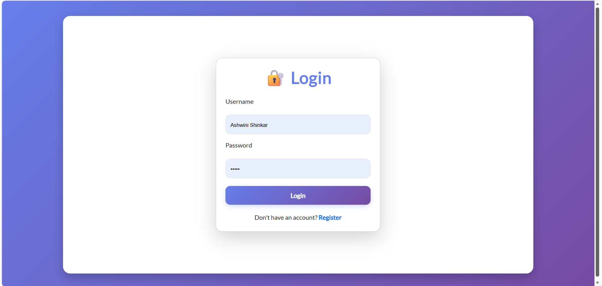
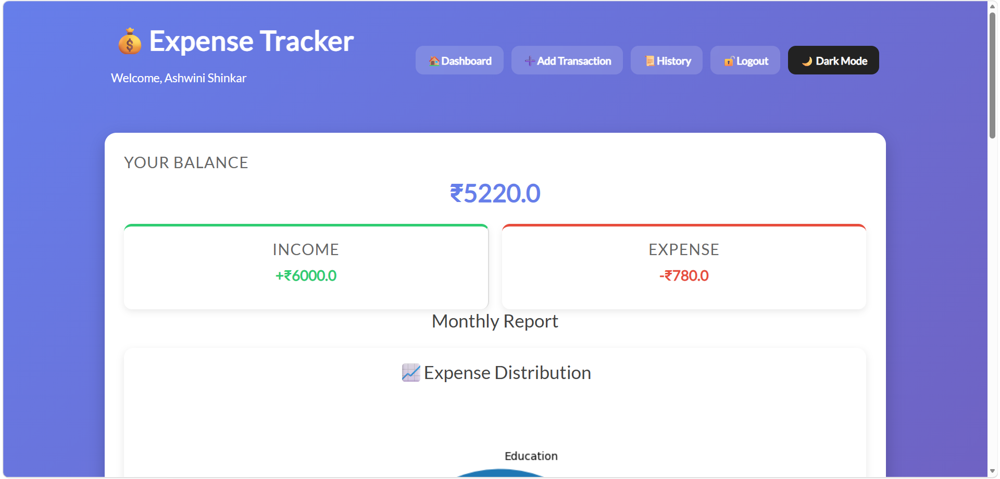
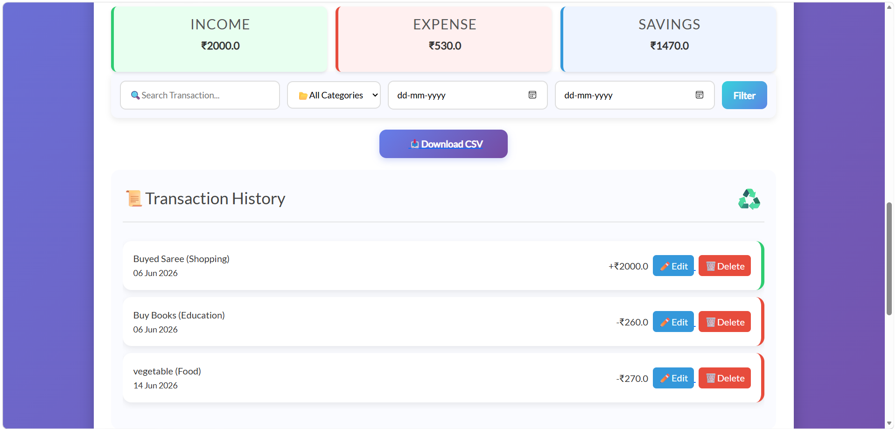
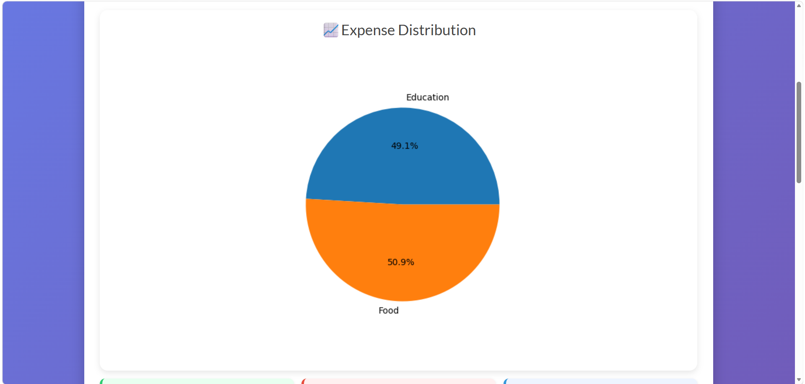
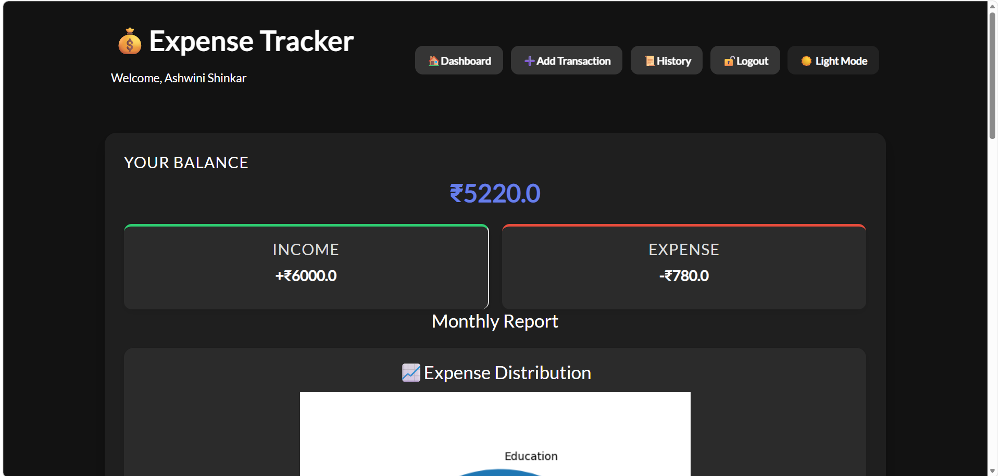
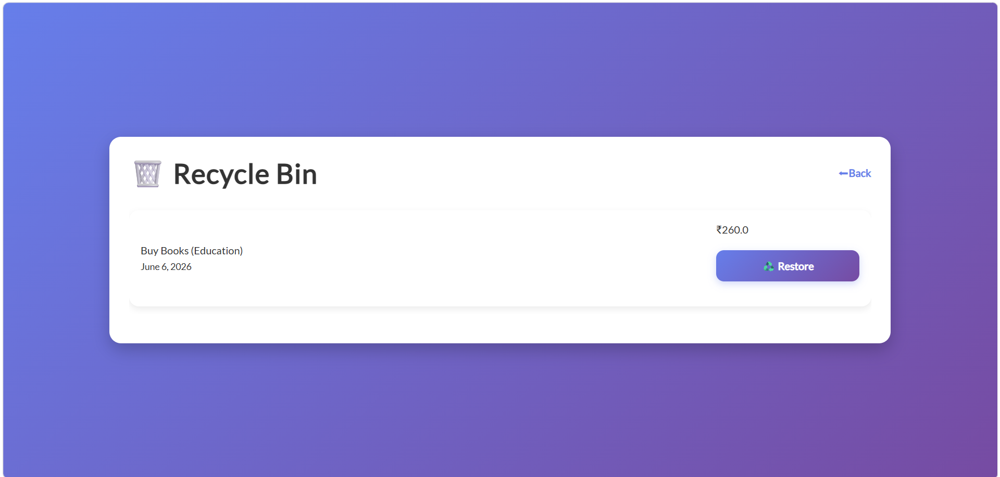

💰 Expense Tracker Web Application

A modern Expense Tracker Web Application built using Django and Python that helps users manage income, expenses, savings, and financial records efficiently.

---

🚀 Features

🔐 Authentication

- User Registration
- User Login & Logout
- Secure User Authentication

💵 Expense Management

- Add Transactions
- Edit Transactions
- Delete Transactions
- Recycle Bin Support
- Restore Deleted Transactions

📊 Analytics & Reports

- Monthly Income Report
- Monthly Expense Report
- Monthly Savings Calculation
- Expense Distribution Pie Chart

🔍 Search & Filters

- Search Transactions
- Filter by Category
- Filter by Date Range

📂 Data Export

- Export Transactions to CSV

🎨 User Interface

- Responsive Dashboard
- Dark Mode Support
- Clean Bootstrap UI
- Interactive Transaction History

---

🛠️ Technologies Used

- Python
- Django
- HTML5
- CSS3
- Bootstrap 5
- JavaScript
- SQLite
- Matplotlib

---

📸 Screenshots

Login Page

Dashboard

Transaction History

Pie Chart Analytics

Dark Mode

Recycle Bin

---

⚙️ Installation

Clone the repository:

git clone https://github.com/ashwinishinkar62/Expense-Tracker.git

Move into project directory:

cd Expense-Tracker

Install dependencies:

pip install -r requirements.txt

Run migrations:

python manage.py migrate

Start the server:

python manage.py runserver

Open:

http://127.0.0.1:8000/

---

📈 Future Improvements

- Budget Planning
- Email Notifications
- PDF Report Export
- Multi-Currency Support
- Cloud Deployment

---

👨‍💻 Developer

Ashwini Shinkar

Final Year Engineering Student | Aspiring Full Stack Developer

Focused on building web applications using Django, Python and modern web technologies.
